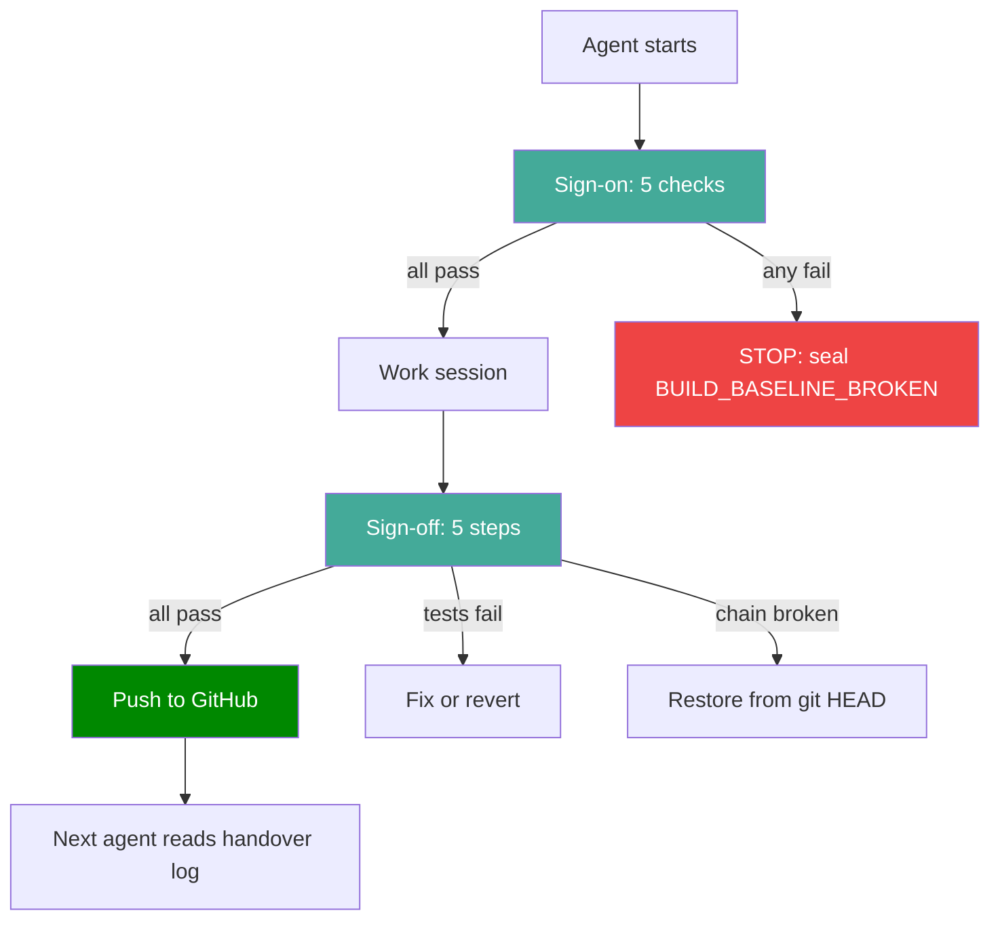

# OGIR Agent Sign-Off Policy — Hermes, opencode, Aider

> Created 2026-07-24. Internal.
> Every agent that touches the OGIR project must sign on and sign off.
> This is the chain-witnessed handover protocol.
> Sealed to chain: `AGENT_SIGNOFF_POLICY_2026_07_24`

---

## WHY

Three agents work on OGIR: Hermes, opencode, and Aider. Each one
needs a defined sign-on (what it's allowed to do), a defined
sign-off (what it must do before leaving), and a handover record
sealed to the chain so the next agent knows what state the project
is in. This prevents the "10 hours of fabrication" problem and
the "agent walked away mid-task" problem.

---

## Agent handover flow (Mermaid)



---

## THE 3 AGENTS

### 1. Hermes (build agent, operator's primary session tool)

**What it is:** Nous Research Hermes Agent v0.18.2, running on
Ollama (minimax-m3:cloud, recommended: qwen2.5-coder). Installed at
`C:\Users\justo\AppData\Local\hermes\`.

**What it does:** Drives the build session — edits code, seals
chain blocks, runs tests, commits to git, deploys Workers.

### 2. opencode (this agent, CLI coding assistant)

**What it is:** opencode running glm-5.2:cloud via Ollama.

**What it does:** Edits code, reads files, runs bash, seals chain
blocks, commits to git. Currently the primary agent for this session.

### 3. Aider (drafting agent, zero-trust sandbox)

**What it is:** Aider running ollama/qwen2.5-coder:7b-instruct-q4_K_M
in `C:\AIDERTESTBOX\`. Zero trust. 8 hard rules muzzle.

**What it does:** Drafts code in a sandbox. Never touches OGIR
source. Output is hand-ported through the seal-test-verify-commit gate.

---

## SIGN-ON PROTOCOL (every agent, every session start)

Each agent MUST do these 5 checks before doing any work:

### Sign-On Checklist

- [ ] **1. Verify the chain:** `$env:PYTHONPATH="02_Technical"; python -m src.verify_chain` → MUST print MATCH
- [ ] **2. Read the last handover:** `cat 04_Validation/HANDOVER_LOG.md` → read the last agent's sign-off
- [ ] **3. Check the bark log:** `cat 04_Validation/scripts/last_seal.log | Select-Object -Last 5` → confirm recent seals
- [ ] **4. Read INDEX.md:** the must-do checklist at the top → confirm no critical items are unaddressed
- [ ] **5. Seal a SIGN_ON block:** `vault_io.append_block("AGENT_SIGN_ON_<NAME>", {"agent": "hermes/opencode/aider", "model": "model name", "session_start": "timestamp"})`

**If any check fails:** STOP. Do not proceed. Seal a
`BUILD_BASELINE_BROKEN` block and report to the operator.

---

## SIGN-OFF PROTOCOL (every agent, every session end)

Each agent MUST do these 5 steps before the operator closes the session:

### Sign-Off Checklist

- [ ] **1. Verify the chain:** `python -m src.verify_chain` → MUST print MATCH
- [ ] **2. Run the tests:** `python -m pytest tests/ -q` → MUST be 400+ passed, 0 failed
- [ ] **3. Write the handover:** append to `04_Validation/HANDOVER_LOG.md` with:
  - Agent name + model
  - Session start + end time
  - What was done (list of chain blocks sealed)
  - What's open (list of unfinished items)
  - What the next agent should do
  - Any broken things
- [ ] **4. Push to GitHub:** `git push origin ogir-build-2026-07-18`
- [ ] **5. Seal a SIGN_OFF block:** `vault_io.append_block("AGENT_SIGN_OFF_<NAME>", {"agent": "hermes/opencode/aider", "blocks_sealed": N, "tests_passed": N, "handover_written": true, "session_end": "timestamp"})`

**If tests fail:** Do NOT sign off. Fix or revert first.
**If chain is broken:** Do NOT sign off. Restore from git HEAD first.

---

## HANDOVER LOG FORMAT

`04_Validation/HANDOVER_LOG.md` — one entry per agent session:

```markdown
## Agent: <name> | Model: <model> | Session: <start> → <end>

### Blocks sealed: N (from block XXXXX to YYYYY)

### What was done:
- Bullet list of changes

### What's open:
- Bullet list of unfinished items

### What the next agent should do:
- Bullet list of next steps

### Broken things (if any):
- Bullet list of issues

### Chain state: MATCH at ZZZZZ blocks
### Test state: NNN passed, N skipped, N failed
### Git: commit hash, pushed to origin: yes/no
```

---

## AGENT-SPECIFIC RULES

### Hermes
- Must use the `ogir-builder` persona (anti-fabrication guardrails)
- Must NOT use minimax-m3:cloud for code tasks (use qwen2.5-coder)
- Must NOT fabricate results — if stuck in 3 turns, STOP
- Can seal chain blocks, commit to git, deploy Workers
- Can edit any file in `02_Technical/` EXCEPT `03_Vault/`

### opencode
- Can edit code, read files, run bash, seal chain blocks, commit to git
- Must follow AGENTS.md (the contributor guide)
- Must NOT touch `03_Vault/` or `04_Validation/hardcopy/` manually
- Must NOT add network imports to `02_Technical/src/`

### Aider
- Zero trust. 100% respect. Must earn trust.
- Can ONLY work in `C:\AIDERTESTBOX\`
- CANNOT read, write, or reference files in the OGIR repo
- CANNOT seal chain blocks, commit to OGIR git, or run OGIR tests
- Everything it produces is a DRAFT — operator hand-ports through seal-test-verify-commit
- 8 hard rules (see `C:\AIDERTESTBOX\.aider.instructions.md`)

---

## THE CHAIN WITNESSES

Every sign-on and sign-off is sealed to the Merkle chain. This means:
- The chain knows which agent worked on the project and when
- The chain knows what state the project was in at sign-off (block count, test count)
- The chain knows what was left open for the next agent
- No agent can silently leave without a record

This is the trust anchor: the chain witnesses who did what.