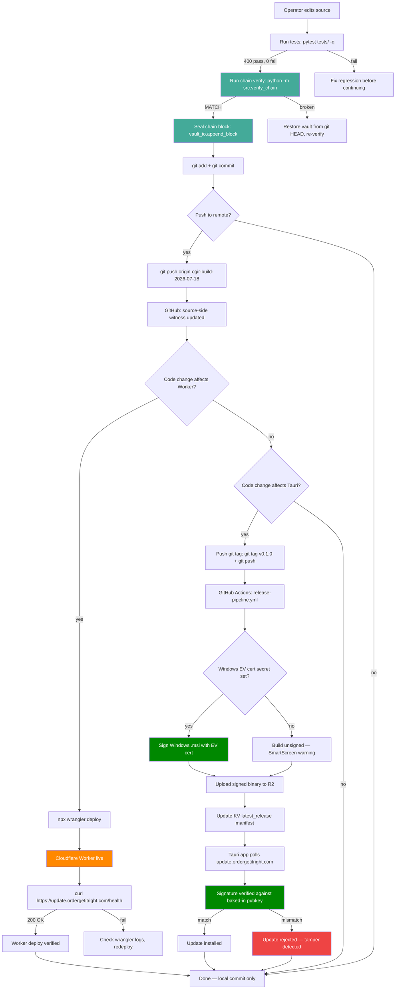

# OGIR Business Handling Flow — Internal

> Generated 2026-07-24. Internal use only — not for clients.
> This is the real-world pipeline of how a code change flows from
> edit to deployed, with the chain as the trust anchor at every
> stage.

## The full pipeline (Mermaid)



## Plain-text version (if Mermaid doesn't render)

```
1. Operator edits source files
2. Run tests:      python -m pytest tests/ -q          → 400 pass, 0 fail
3. Run chain:      python -m src.verify_chain           → MATCH
4. Seal block:     vault_io.append_block(event_type, payload)
5. Git commit:     git add -A && git commit -m "<event_type>: ..."
6. Git push:       git push origin ogir-build-2026-07-18   (→ GitHub)
7. Worker deploy:  cd 02_Technical/cloudflare-worker && npx wrangler deploy  (→ Cloudflare)
8. Verify Worker:  curl https://update.ordergetitright.com/health            → 200 OK
9. Tag release:    git tag v0.1.0 && git push origin v0.1.0   (→ GitHub Actions)
10. CI builds:      release-pipeline.yml (4-platform matrix)
11. CI signs:       Windows .msi signed with EV cert (if WINDOWS_CERTIFICATE secret set)
12. CI uploads:     signed binary → R2 bucket (ordergetitright-releases)
13. Update KV:      latest_release manifest updated with new version + signature
14. Tauri polls:    update.ordergetitright.com/windows-x86_64/0.0.9 → manifest
15. Tauri verifies: signature checked against pubkey baked into tauri.conf.json
16. Update installs OR is rejected if signature doesn't match
```

## The two witnesses at every stage

| Stage | Chain witness (trust anchor) | Git witness (code management) |
|-------|------------------------------|-------------------------------|
| Source edit | — | working tree dirty |
| Tests pass | — | — (ephemeral) |
| Chain verify | `verify_chain` MATCH | — |
| Seal | `append_block` adds block N+1 | — |
| Git commit | commit subject = chain event_type | commit hash + diff |
| Git push | — | remote branch updated |
| Worker deploy | Worker version ID | — |
| Worker health | — | — |
| Tag release | — | git tag pushed |
| CI build | — | GitHub Actions run |
| CI sign | — | signed binary artifact |
| R2 upload | — | binary in R2 bucket |
| KV update | latest_release manifest | — |
| Tauri update check | — | HTTP poll |
| Tauri signature verify | signature in KV manifest | pubkey in tauri.conf.json |
| Update installed | — | new version running |

## What the chain witnesses (and what it doesn't)

**The chain witnesses:**
- Every audit decision (the 4-gate pipeline result)
- Every code change (the seal block with event_type + files_changed)
- Every state change (JOB_QUEUED, JOB_CLAIMED, JOB_COMPLETED, SHUTDOWN)
- Every domain/cert purchase (BLOCK_F_*, DOMAIN_REGISTERED_*)
- Every Worker deploy (WORKER_DEPLOYED_*)

**The chain does NOT witness:**
- The Git diff (that's Git's job)
- The GitHub Actions run (that's GitHub's job)
- The R2 binary content (that's Cloudflare's job)
- The Tauri signature verification (that's the Tauri runtime's job)

The chain is the **trust anchor** for *what the engine decided*. Git
is the **code management layer** for *what the operator changed*.
Cloudflare is the **distribution layer** for *what the client
receives*. They are not interchangeable.

## The single-writer invariant

Only one process writes to the chain at a time. The chain is
`03_Vault/facts_registry.json` — a single JSON file with a SHA-256
hash chain. Under uvicorn with a single worker (the default), this
is safe. Under `--workers N` where N > 1, two workers could each
read the same state, append their own block, and the later writer
would clobber the earlier one. Do NOT run with `--workers N` where
N > 1 without first adding a process-wide lock around
`vault_io.append_block`.

The temp-vault test fixture (`tests/conftest.py`) ensures tests
never write to the live chain. Each test gets a throwaway vault in
a per-test temp directory.

---

**Document generated:** 2026-07-24
**Internal use only.** Not for clients, not for public release.
**Sealed to chain:** `BUSINESS_HANDLING_FLOW_2026_07_24`